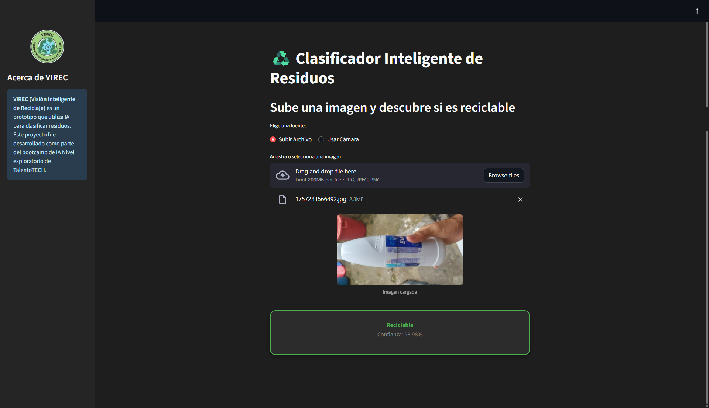

# VIREC: Visión Inteligente de Reciclaje ♻️

Prototipo de un clasificador de residuos sólidos utilizando visión por computador y aprendizaje por transferencia. Este proyecto fue desarrollado como el proyecto final del bootcamp de IA Nivel Explorador de TalentoTECH.



## 🚀 Stack Tecnológico


---

## 📋 Descripción del Proyecto

VIREC es un pipeline de MLOps de extremo a extremo que permite:
- **Gestionar y sanitizar** un dataset de imágenes de forma colaborativa.
- **Entrenar y evaluar** modelos de clasificación de imágenes de forma automatizada.
- **Desplegar** el mejor modelo en una interfaz web interactiva.

## 📂 Estructura del Repositorio

- **/notebooks:** Contiene los Google Colab notebooks para cada etapa del pipeline.
  - `00_Preparacion_y_Auditoria_Datos.ipynb`: Herramientas para **sanitizar** datos crudos (convertir HEIC, eliminar duplicados por hash) y **auditar** la consistencia de todo el pipeline.
  - `01_Preprocesamiento_Dataset.ipynb`: Script para organizar y dividir el dataset en conjuntos de entrenamiento, validación y prueba.
  - `02_Entrenamiento_Modelo.ipynb`: Pipeline automatizado para ejecutar experimentos de entrenamiento definidos en Google Sheets.
  - `03_Streamlit_App_Launcher.ipynb`: Notebook para seleccionar un modelo entrenado y **lanzar** la interfaz web a través de un túnel de ngrok.
- **/streamlit_app:** Contiene el código fuente de la aplicación de Streamlit (`app.py`) y sus activos estáticos (CSS, logo).
- **/google_workspace:** Incluye el código de Apps Script y las plantillas CSV para configurar las Hojas de Cálculo de Google.
- **/assets:** Imágenes y diagramas utilizados en la documentación.
- `requirements.txt`: Archivo que lista todas las dependencias de Python del proyecto.
- `config.py.template`: Plantilla para el archivo de configuración local.

---

## ⚙️ Instalación y Configuración

Sigue estos pasos para poner en marcha el proyecto en tu propio entorno de Google.

### 1. Clonar el Repositorio
```bash
git clone https://github.com/tu-usuario/Proyecto_VIREC.git
```

### 2. Configurar Google Drive
- Sube la carpeta clonada `Proyecto_VIREC` a tu **"Mi unidad"** en Google Drive.
- Dentro de `Proyecto_VIREC/dataset/`, crea las carpetas `fotos_crudas_propias` y `fotos_crudas_externas` y sube tus imágenes allí.

### 3. Configurar Google Sheets y Apps Script
- **Crea dos Hojas de Cálculo** en tu Google Drive.
- **Hoja de Etiquetas:**
  - Dale el nombre que prefieras (ej. "VIREC - Hoja de Etiquetas").
  - Asegúrate de que la primera pestaña se llame **"Lista de etiquetas"**.
  - Copia los encabezados de `google_workspace/hoja_etiquetas_template.csv`.
  - Abre `Extensiones > Apps Script`, borra el código por defecto y pega el contenido de `google_workspace/apps_script_code.js`. Guarda el proyecto.
- **Hoja de Experimentos:**
  - Dale el nombre que prefieras (ej. "VIREC - Hoja de Experimentos").
  - Asegúrate de que la primera pestaña se llame **"Experimentos"**.
  - Copia los encabezados de `google_workspace/hoja_experimentos_template.csv`.

### 4. Crear tu Archivo de Configuración Local (`config.py`)
- En la raíz de tu proyecto, haz una copia de `config.py.template` y renómbralo a `config.py`.
- Abre `config.py` y rellena **todas** las variables con tu información personal. **Este archivo no se subirá a GitHub.**

---

## 🏃‍♂️ Cómo Ejecutar el Pipeline

1.  **Sanitizar:** Abre `00_Preparacion_y_Auditoria_Datos.ipynb` en Google Colab. Ejecuta las celdas para limpiar tus datos crudos.
2.  **Sincronizar:** Usa la herramienta en Google Sheets (menú `🤖 VIREC Tools`) para listar los nuevos archivos limpios.
3.  **Etiquetar:** Rellena las etiquetas en la hoja de cálculo.
4.  **Organizar:** Abre `01_Preprocesamiento_Dataset.ipynb` y ejecútalo para organizar tu dataset en `train/val/test`.
5.  **Experimentar:** Define tus experimentos en la "Hoja de Experimentos".
6.  **Entrenar:** Abre `02_Entrenamiento_Modelo.ipynb` y ejecútalo para entrenar tus modelos de forma automatizada.
7.  **Lanzar Interfaz:** Abre `03_Streamlit_App_Launcher.ipynb`, selecciona el modelo que quieres probar y ejecuta las celdas para lanzar la aplicación web.
