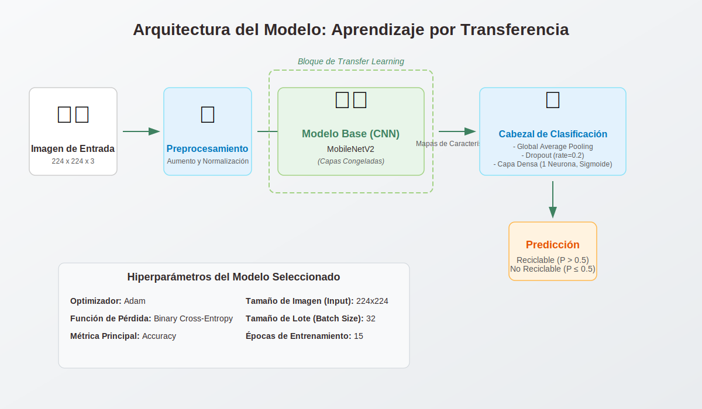

# VIREC: Visión Inteligente de Reciclaje ♻️

Prototipo de un clasificador de residuos sólidos utilizando visión por computador y aprendizaje por transferencia. Este proyecto fue desarrollado como el proyecto final del bootcamp de IA Nivel Explorador de TalentoTECH.


## 🚀 Stack Tecnológico


---

## 📋 Descripción del Proyecto

VIREC es un pipeline de MLOps de extremo a extremo que permite:
- **Gestionar y sanitizar** un dataset de imágenes de forma colaborativa.
- **Entrenar y evaluar** modelos de clasificación de imágenes de forma automatizada.
- **Desplegar** el mejor modelo en una interfaz web interactiva.

## 📂 Estructura del Repositorio

- **/notebooks:** Contiene los Google Colab notebooks para cada etapa del pipeline.
  - `00_Preparacion_y_Auditoria_Datos.ipynb`: Herramientas para limpiar, convertir y auditar los datos crudos directamente desde Google Drive y Sheets.
  - `01_Preprocesamiento_Dataset.ipynb`: Script para organizar y dividir el dataset en conjuntos de entrenamiento, validación y prueba.
  - `02_Entrenamiento_Modelo.ipynb`: Pipeline automatizado para ejecutar experimentos de entrenamiento definidos en Google Sheets.
  - `03_Streamlit_App_Launcher.ipynb`: Notebook para seleccionar un modelo entrenado y lanzarlo en la interfaz web.
- **/streamlit_app:** Contiene el código fuente de la aplicación de Streamlit (`app.py`) y sus activos estáticos (CSS, logo).
- **/google_workspace:** Incluye el código de Apps Script y las plantillas CSV para configurar las Hojas de Cálculo de Google.
- **/assets:** Imágenes y diagramas utilizados en la documentación.
- `requirements.txt`: Archivo que lista todas las dependencias de Python del proyecto.
- `config.py.template`: Plantilla para el archivo de configuración local.

---

## 🏛️ Arquitectura del Modelo



---

## ⚙️ Instalación y Configuración

Sigue estos pasos para poner en marcha el proyecto en tu propio entorno de Google.

### 1. Clonar el Repositorio
```bash
git clone https://github.com/Novav20/Proyecto_VIREC.git
```

### 2. Configurar el Entorno de Google Drive
- Sube la carpeta `Proyecto_VIREC` a tu "Mi unidad" en Google Drive.
- Dentro de `Proyecto_VIREC/dataset/`, crea las carpetas `fotos_crudas_propias` y `fotos_crudas_externas` y sube tus imágenes allí.

### 3. Configurar Google Sheets y Apps Script
- **Crea dos Hojas de Cálculo** en tu Google Drive.
- **Hoja de Etiquetas:**
  - Dale un nombre (ej. "VIREC - Hoja de Etiquetas del Dataset").
  - Asegúrate de que la primera pestaña se llame **"Lista de etiquetas"**.
  - Copia los encabezados de `google_workspace/hoja_etiquetas_template.csv`.
  - Abre `Extensiones > Apps Script`, borra el código por defecto y pega el contenido de `google_workspace/apps_script_code.js`. Guarda el proyecto.
- **Hoja de Experimentos:**
  - Dale un nombre (ej. "VIREC - Hoja de Experimentos").
  - Asegúrate de que la primera pestaña se llame **"Experimentos"**.
  - Copia los encabezados de `google_workspace/hoja_experimentos_template.csv`.

### 4. Crear tu Archivo de Configuración Local
- En la raíz de tu proyecto, haz una copia de `config.py.template` y renómbralo a `config.py`.
- Abre `config.py` y rellena **todas** las variables:
  - `NGROK_AUTH_TOKEN`: Tu token de autenticación de Ngrok.
  - `NOMBRE_HOJA_ETIQUETAS`: El nombre exacto que le diste a tu Hoja de Cálculo de etiquetas.
  - `NOMBRE_HOJA_EXPERIMENTOS`: El nombre exacto de tu Hoja de Cálculo de experimentos.
  - `CLASES_MODELO`: La lista de clases para la clasificación (ej. `['no_reciclable', 'reciclable']`).
  - `TIMEZONE`: Tu zona horaria (ej. `'America/Bogota'`).
- **Este archivo `config.py` no se subirá a GitHub.**

### 5. Instalar Dependencias
No es necesario instalar nada manualmente. Cada notebook de Colab se encargará de instalar las dependencias listadas en `requirements.txt` al ejecutar la primera celda de código.

---

## 🏃‍♂️ Cómo Ejecutar el Pipeline

1.  **Abre `00_Preparacion_y_Auditoria_Datos.ipynb` en Google Colab.** Ejecuta las celdas para sanitizar tus datos crudos. La auditoría ahora se conecta directamente a tu Google Sheet.
2.  **Usa la herramienta en Google Sheets** (el menú `VIREC Tools`) para sincronizar y listar los nuevos archivos limpios.
3.  **Etiqueta tus datos** en la hoja de cálculo.
4.  **Abre `01_Preprocesamiento_Dataset.ipynb`** y ejecútalo. Leerá las etiquetas directamente de la hoja y organizará tu dataset.
5.  **Define tus experimentos** en la "Hoja de Experimentos".
6.  **Abre `02_Entrenamiento_Modelo.ipynb`** y ejecútalo para entrenar tus modelos de forma automatizada.
7.  **Abre `03_Streamlit_App_Launcher.ipynb`**, selecciona el modelo que quieres probar en el menú desplegable y ejecuta las celdas para lanzar la aplicación web.
